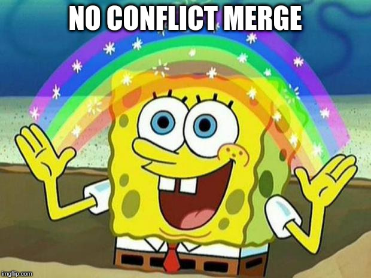
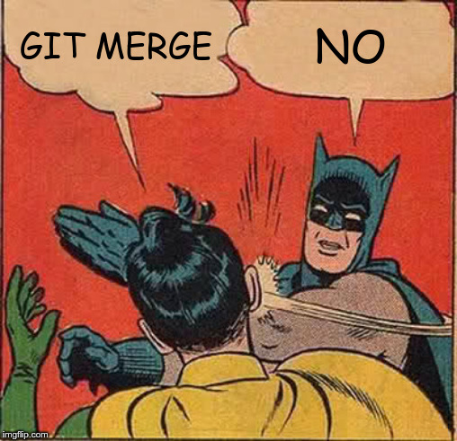
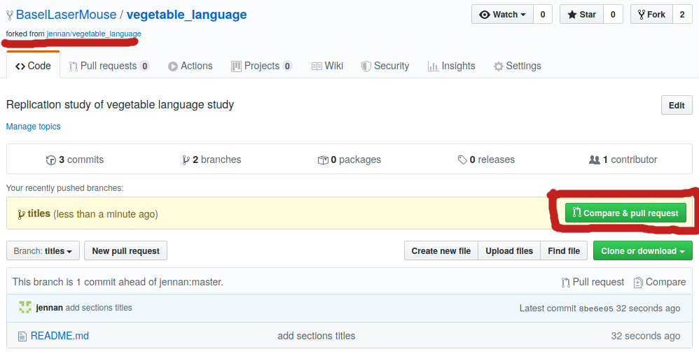
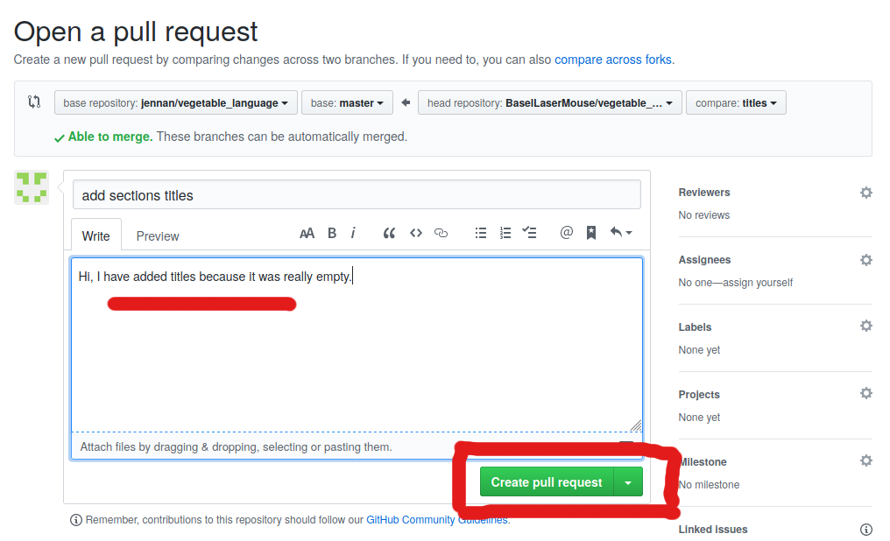
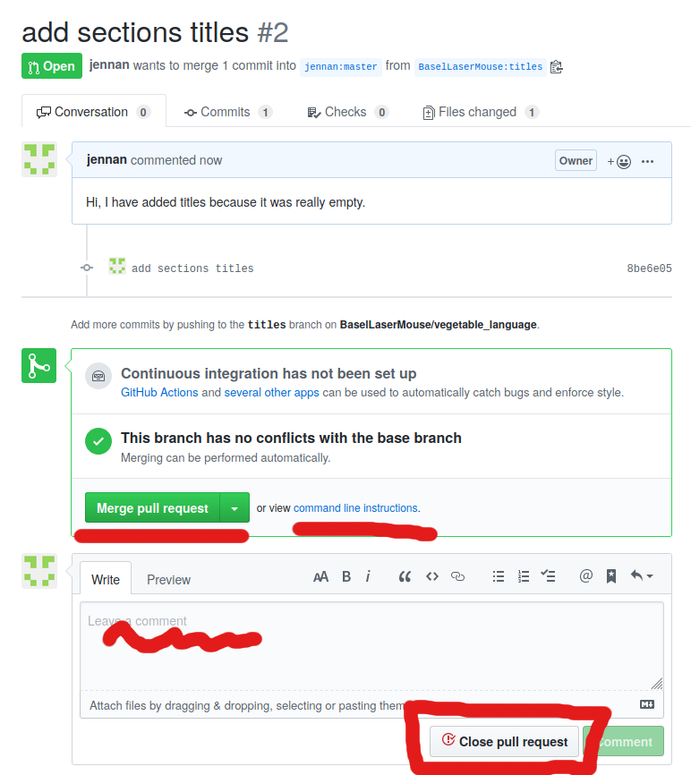

# Today's menu

- Additional handy commands (45 min)

- **Break** (15 min)

- Branching (45 min)

- **Break** (15 min)

- Collaborative platforms (45 min)

- Bonus or **lunch** :-) 

---

# Bash memo

- `pwd`: **p**rint **w**orking **d**irectory
- `ls`: **l**i**s**t directory content
- `man`: display *man*ual (`Q` to exit pager)
- `cd`: **c**hange directory
- `mkdir`: **m**a**k**e **dir**ectory
- `nano`: text editor in the terminal (`^` is ctrl key)
- `cat`: con**cat**enate files, used to display one here

---

# Git memo

- `git config`: set username, email, default editor...
- `git init`: initialize a git repository
- `git status`: display current status (e.g. modified files)
- `git add`: record changes for next commit ("staging")
- `git commit`: save staged changes as a commit (snapshot)
- `git log`: display commit history
- `git diff`: files changes since last commit
- `git show`: display file content for a precise commit
- `git checkout`: travel between commits 
- `git remote`: configure distant repository
- `git push`: send commit to another repository
- `git pull`: get new commits from another repository
- `git clone`: retrieve a local copy of a repository

---

# Additional handy commands (45 min)

- git add/commit/push cycle

- git commit [-av] with long message

- .gitignore

- git reset

- git revert

- git stash

- gitk (and other viewers)

---

# The electrophysiology of Vegetable Language (replication)

{width=40%}

Let's write a fictitious paper to replicate *Frisch and Graben, 2007*:

- fork **github.com/jennan/vegetable_language** on Github
- clone your fork of the repository to your computer

---

# Practice `git add/commit/push`

Commit as often as possible, i.e. as often as saving documents.

- add **Introduction** section to the `README.md` file
```bash
nano README.md
git add README.md
git commit -m "add intro section title"
```
- add **Methods** section to the `README.md` file, and push
```bash
nano README.md
git add README.md
git commit -m "add methods section title"
git push
```

---

# Faster/better commits with `git commit -av`


- useful optional flags for the `git commit` command

    - flag `-a` (or `--all`) to automatically stage changed files
    - `/!\` you still need to manually add new files `/!\`
    - flag `-v` (or `--verbose`) to see differences in commit message

- add **Results** section
```bash
nano README.md
git commit -av
git status
```

- add **Discussion** section
```bash
nano README.md
git commit -am "add discussion section"
git status
git log
```

---

# Ignoring things using `.gitignore` file

- create a junk file and a spurious folder
```bash
cp README.md README.md~
mkdir tmp
nano tmp/more_junk_file.txt
git status
```

- create a `.gitignore` file
```bash
nano .gitignore
git add .gitignore
git commit -m "Ignore junk files"
git status
```

**Note:** local vs. user's `.gitignore` files

---

# Remove changes using `git reset`

- make some changes to `README.md` and stage (no commit)
```bash
nano README.md
git add README.md
git status
```

- unstage changes using `git reset`
```bash
git reset README.md
git status
git diff
```

- remove all changes (to all file) using `git reset --hard`
```bash
git reset --hard
git status
git diff
```

**Note:** remember `git checkout` to remove changes for one file

---

# Undo changes with `git revert`

- create a new commit to undo a previous commit

- remove `README.md` and commit
```bash
rm README.md
git commit -am "remove README.md"
ls -la
```

- recover the file by undoing the last commit
```bash
git revert HEAD
ls -la
git log
```

**Note:** useful if changes already pushed

---

# Temporary discard changes with `git stash`

- make some changes to `README.md` (no commit)
```bash
nano README.md  # add a bit of context in the intro
git status
cat README.md
```

- aaarg, boss wants to see last clean version, use `git stash`!
```bash
git stash
cat README.md
```

- back to work, recover changes and commit
```bash
git stash pop
cat README.md
git commit -av
```

**Note:** `git stash list` and `git stash drop`

---

# Viewers: `gitk` and friends

- `gitk` is available everywhere

- other graphical/cli clients: gitg, kraken, sourcetree, tig...

- I personally use them to look at commits and files history.

---


---

# Branching (45 min)

- git checkout [-b]

- git branch

- git push -u

- git merge

- feature branch workflow

---

# What is a branch?

. . .


---

# Create a branch, switch branches

- create a new branch called **abstract** and switch to it
```bash
git status
git checkout -b abstract
git status
```

- add some content unique to this branch
```bash
nano ABSTRACT.md  # create an abstract
git add ABSTRACT.md
git commit -m "WIP abstract"
```

- switch back and forth using `checkout`
```bash
git checkout master
ls
git checkout abstract
ls
```

---

# Local vs. distant branches

- display local and distant branches
```bash
git branch -a
```

- create a distant branch by pushing
```bash
git checkout abstract
git push  # try to push, read git suggestion
git push -u origin abstract
```

- check the new distant branch (also on Github)
```bash
git branch -a
gitk  # brrr graphical interface
```

---

# Delete branches

- create a dummy branch, say **fake_data**, and push it
```bash
git checkout master
git checkout -b fake_data
git push -u origin fake_data
git status
```

- delete distant branch using push (or Github)
```bash
git push origin --delete fake_data
gitk
```

**Note:** if using github, update local repo using `git fetch -p`

- delete local branch using `-d` (or `-D`)
```bash
git checkout master  # switch to another branch
git branch -d fake_data
gitk
```

**Note:** use `-D` to delete non-dummy/non-merged branches

---

# Merge branches -- easy case

- let's add a bit more content to **master**
```bash
git checkout master
nano README.md  # discuss subjects in methods
git commit -am "Add subjects"
```

- merge **abstract** branch
```bash
git status
git merge abstract
```

. . .

::: columns

:::: {.column width=0.5}
- contemplate
```bash
ls -la
gitk
```
::::

:::: {.column width=0.4}

::::

:::

---

# Merge branches -- not so easy case

- switch to a **methods** branch and edit methods
```bash
git checkout -b methods
nano README.md  # explain (in)coherent sentences
git commit -am "explain paradigm"
```

- switch to **master** branch and change same text
```bash
git checkout master
nano README.md  # add electrodes locations 
git commit -am "ephys explanations"
```

. . .

::: columns

:::: {.column width=0.6}
- enjoy a good conflict (or redo)
```bash
git merge methods
git status
```
::::

:::: {.column width=0.35}
{width=80%}
::::

:::

---

# Content of `README.md` during conflict

```markdown
# The electrophysiology of Vegetable language...

[...]

<<<<<<< HEAD
Eletrodes are located at Cz and Pz.
=======
Subjects are exposed to coherent and incoherent...
>>>>>>> methods

## Results

[...]
```

---

# Fix conflicts

- edit conflicts and bring back peace in the repository
```bash
nano README.md
git add README.md
git status
git commit -av
```

- emergency command to cancel (then redo from merge)
```bash
git merge --abort
```

- use a merge tool, I personally like **meld**
```bash
git mergetool  # brrr again a graphical tool
```

---

# Feature branch workflow

- **master** always contains working version
- create a branch for each new feature
- merge to **master** as soon as feature is ready
- bonus: keep history relatively clean

\ 

{width=80%}

**Note:** This is the GitHub flow flavor.

<!-- show real repository history -->

---


---

# Collaborative platforms (45 min)

- fork and pull requests

- tickets systems

- good practices (be a good commitizen)

---

# Fork and pull requests

Github (and bitbucket, gitlab etc.) platform to collaborate:

1. fork the repository of interest

2. make relevant changes (bug fix, new feature...)

3. politely **request** the owner to **pull** your code in his repository

---

# Pull requests -- contributor side



---

# Pull requests -- contributor side



---

# Pull requests -- code owner side

{height=90%}

---

# Pull requests -- practice

- pair up with your neighbor
- one is the **owner**, and one is the **contributor**

`/!\` **contributor** deletes its local copy of `vegetable_language`

Create a pull request

- **contributor** forks `vegetable_language` repo from **owner**
- **contributor** clones it and make some changes
- **contributor** creates a pull request

Integration of the pull request

- **owner** reviews the pull request, ask for more stuff
- **contributor** adds more commits to update the pull request
- **owner** accepts (or not) final changes

---

# Tickets systems

Organize issues, feature request, milestones etc.

Issues can be linked with tickets:

- **web browser:** create a ticket, asking for more content
- **terminal:**
 
    - create a new commit
    - use `closes #<issue number>` in the commit message 
    - push the commit 

- **web browser:** check issue status

<!-- example from cellfiner, or scikit-learn -->

---

# Good practices

Convention for commit messages:

- short first line (max ~80 characters) to describe changes
- blank line
- paragraph to give more context, details...

Pull request:

- make sure your work is wanted before starting it
- create a separate feature branch
- keep author(s) conventions (code, commit titles, provide tests if needed)
- ask for help if it's your first pull request

Tickets:

- provide a minimally reproducible example, see [Stack Overflow](https://stackoverflow.com/help/minimal-reproducible-example) 

---

{width=60%}

---

# Bonus

- git tag
- git blame
- git cherry-pick
- git rebase
- git subtree
- git filter-branch
- stackoverflow
- stackoverflow
- stackoverflow
- stackoverflow
- stackoverflow
- stackoverflow
